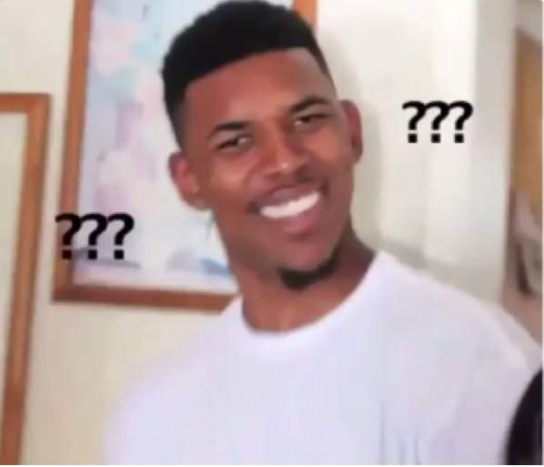

**English** · [繁體中文](README.zh-TW.md)

A personal meme library: you describe the situation, and it finds the meme.

## Why

While chatting, you sometimes want to answer with a meme. You remember the **situation** it fits,
but not its **name**, so you cannot find the one you want at that moment. And a phone full of saved
memes is hard to search and takes up space.

WTM keeps your memes in one place, each one described by what it means and when to use it,
so remembering the situation is enough to find it.

## What you can do

WTM has three things, one page each.

### 1. Find memes

Type what you would say out loud, or describe the picture itself. Below the search bar are the most common
recent searches as shortcuts, and below those a random handful of memes to browse. Every meme has a
**download** and a **favorite** button.

You are chatting, and the other person says something you cannot make sense of. You do not know what
that "confused guy" meme is called, so you type:

> **when I do not understand what someone just said**

and the meme that fits comes back:

You can also describe **the picture itself**, the way you would to a friend who cannot remember
its name: what it looks like, or the nickname people give it. Either of these finds the same meme:

> **a smiling guy with question marks around his head**
>
> **confused Nick Young**

*(Illustration of the intended behaviour; the picture is a meme collected from the web.)*

### 2. Favorites

Star the memes you will want again. They are listed on their own page, so next time you do not need to
search: one click to download.

### 3. Meme maker

Pick one of your favorites and make it your own: draw text boxes on the picture, type the text, choose how it
looks, and download the result. The picture is drawn in your browser and is never sent to the server, so what
you make stays with you.

## Adding memes to the library

The library is filled by the administrator: choose pictures or a folder, paste an address, or let the built-in
collector read a source (Imgflip, Wikimedia Commons, a PTT board). A vision model looks at every new picture and
writes what it means, when to use it, and the text in it. Identical and near-identical pictures are collected
only once, and each picture keeps a note of where it came from.

## More

How to run it, the API, the design decisions and the known limitations are in
[docs/technical.md](docs/technical.md) and [docs/DECISIONS.md](docs/DECISIONS.md).
