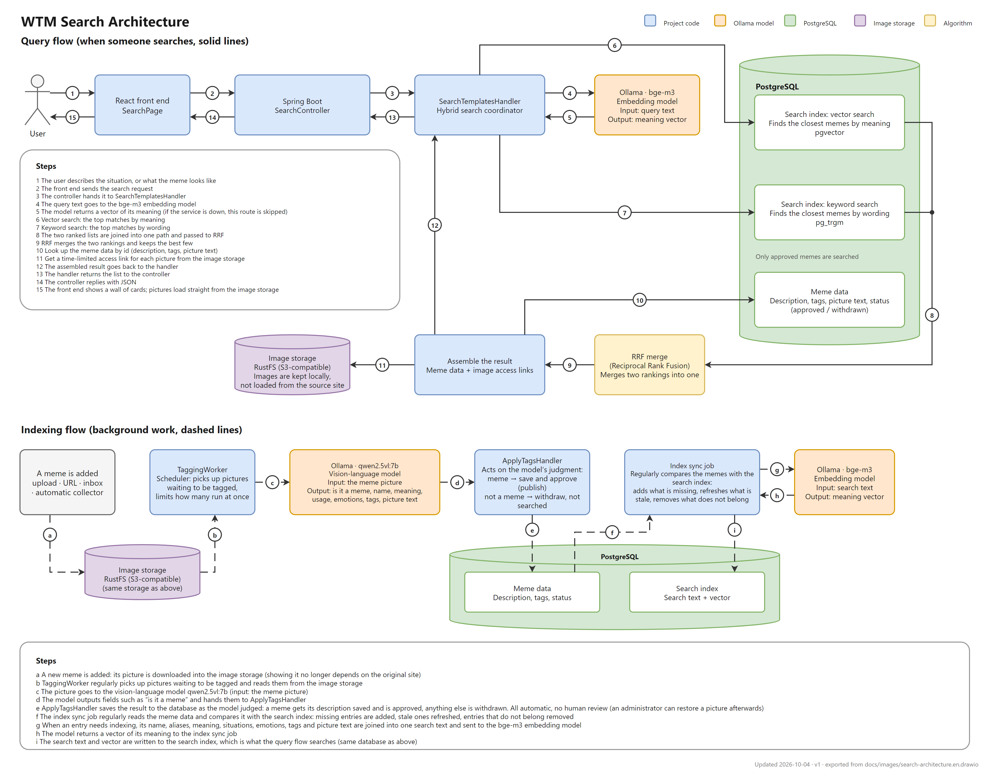

<p align="center"></p>

**English** · [繁體中文](README.zh-TW.md)

A personal meme library: you describe the situation, and it finds the meme.

## Why

While chatting, you sometimes want to answer with a meme. You remember the **situation** it fits,
but not its **name**, so you cannot find the one you want at that moment. And a phone full of saved
memes is hard to search and takes up space.

WTM keeps your memes in one place, each one described by what it means and when to use it,
so remembering the situation is enough to find it.

## What you can do

WTM has three things, one page each.

### 1. Find memes

Type what you would say out loud, or describe the picture itself. Below the search bar are the most common
recent searches as shortcuts, and below those a random handful of memes to browse. Every meme has a
**download** and a **favorite** button, and a **report** button for when the description or tags do not fit.

You are chatting, and the other person says something you cannot make sense of. You do not know what
that "confused guy" meme is called, so you type:

> **when I do not understand what someone just said**

and the meme that fits comes back:

<p align="center"></p>

You can also describe **the picture itself**, the way you would to a friend who cannot remember
its name: what it looks like, or the nickname people give it. Either of these finds the same meme:

> **a smiling guy with question marks around his head**
>
> **confused Nick Young**

*(Illustration of the intended behaviour; the picture is a meme collected from the web.)*

If you would rather not choose yourself, switch the search bar to **Pick one for me** and describe the situation
("my friend keeps saying I over-react, pick a meme to answer him"). WTM finds the eight closest memes, offers the closest one
with a language model's note on whether and why it fits (written by AI, so it can be wrong), and keeps the others below as
alternatives. It only ever offers memes from the library.

### 2. Favorites

Star the memes you will want again. They are listed on their own page, so next time you do not need to
search: one click to download.

### 3. Meme maker

Pick one of your favorites and make it your own: draw text boxes on the picture, type the text, choose how it
looks, and download the result. The picture is drawn in your browser and is never sent to the server, so what
you make stays with you.

## Adding memes to the library

The library is filled by the administrator: choose pictures or a folder, paste an address, or let the built-in
collector read a source (Imgflip, Wikimedia Commons, a PTT board). A vision model looks at every new picture and
writes what it means, when to use it, and the text in it. Identical and near-identical pictures are collected
only once, and each picture keeps a note of where it came from.

When someone reports a meme, the vision model looks at the picture again, with their complaint in hand, and the
administrator sees both side by side ("user report: ...; suggested change: ...") to adopt or dismiss.

## Architecture

A search runs two lookups in PostgreSQL, a vector search (`bge-m3` embeddings with pgvector) and a keyword search
(`pg_trgm`), and merges the two rankings with reciprocal rank fusion. In the background, a vision model
(`qwen2.5vl`) describes every new picture and a sync job keeps the search index in line with the library.
The picture files themselves are stored in S3-compatible object storage (RustFS), not fetched from their original sites.

[](docs/images/search-architecture.en.drawio.png)

*Click the diagram to see it at full size. The editable source is
[search-architecture.en.drawio](docs/images/search-architecture.en.drawio) (open it with draw.io); the
[Traditional Chinese version](docs/images/search-architecture.drawio.png) is kept next to it. The reasons behind each
choice are in [docs/DECISIONS.md](docs/DECISIONS.md).*

## Before you run it for real

- **It is a personal tool, not a service.** There is no logout or password reset, the sign-in token is kept in the
  browser's `sessionStorage` and there is no Content-Security-Policy, so do not expose it to the internet as it is.
- **The library is yours to fill, and yours to answer for.** The repository contains no collected pictures. The
  collector reads Imgflip, Wikimedia Commons and PTT politely (it obeys `robots.txt`, waits between requests and says
  who it is), but what you collect is still other people's work: follow each site's terms and respect the copyright
  of the pictures.

## License

The code is under the [MIT License](LICENSE). That covers the code, not everything in the repository: the example
picture in `docs/images/confused-nick-young.jpeg` is a meme collected from the web and belongs to whoever made it.

## Run it from Docker

The images are on Docker Hub (`russellli/wtm-backend`, `russellli/wtm-web`). With the project's `.env` in place:

```bash
docker compose -f docker-compose.app.yml up -d   # then open http://localhost:8080
```

See [docs/technical.md](docs/technical.md#docker-images-ci-and-releases) for what it starts and how releases are made.

## More

How to run it, the API, the design decisions and the known limitations are in
[docs/technical.md](docs/technical.md) and [docs/DECISIONS.md](docs/DECISIONS.md).
