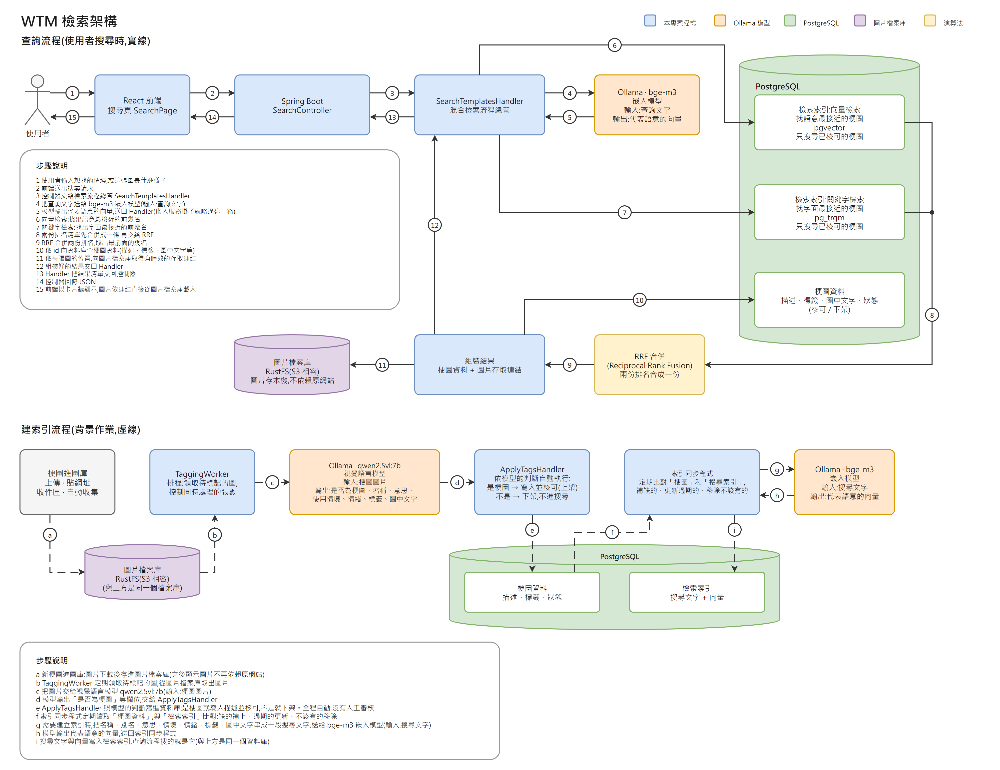

<p align="center"></p>

[English](README.md) · **繁體中文**

個人的梗圖圖庫:描述情境,就找得到那張梗圖。

## 為什麼做這個

跟別人聊天時,有時候想用梗圖回應,但你只記得它適用的**情境**,不記得梗圖的**名稱**,所以找不到當下想用的那一張。
而手機裡存了一大堆梗圖,既不好找,又佔空間。

WTM(Where's That Meme?)把你的梗圖集中放在一個地方,每一張都記錄了它的意思與使用時機,
所以只要記得情境,就能找到它。

## 你可以做什麼

WTM 有三個功能,各有一個頁面。

### 1. 找梗圖

輸入你會直接說出口的話,或是直接描述這張圖本身。搜尋列下方是最近的熱門搜尋,點一下就能搜;再下面是隨機的梗圖,
可以隨便逛逛。每張梗圖都有**下載**、**收藏**和**回報**三個按鈕,覺得標籤或描述不精確時可以回報。

聊天時對方說了一句你完全聽不懂的話,你想貼那張「一臉困惑的人」的梗圖,卻不知道它叫什麼名字。
這時候你只要輸入:

> **聽不懂對方剛剛在說什麼**

適合的梗圖就出現了:

<p align="center"></p>

你也可以直接描述**這張圖本身**,就像在跟朋友說「那個…你知道的啦」:講它的長相,或是大家都怎麼叫它。
下面任何一種說法,都找得到同一張梗圖:

> **黑人問號**
>
> **一個笑著的人,頭旁邊都是問號**

*(這是預期行為的示意;圖片是從網路上收集來的梗圖。)*

如果你不想自己挑,把搜尋列切到**幫我挑一張**,描述你遇到的處境(例如「朋友一直說我 over react,幫我挑一張回他的梗圖」)。
WTM 會先找出最接近的八張,把最接近的一張交給你,並附上語言模型對它適不適合的看法(AI 寫的,可能不準),其他幾張留在下面當備選。
它只會從圖庫裡找,不會自己編一張。

### 2. 梗圖收藏

把以後還會用到的梗圖按下收藏,它們會集中在自己的頁面。下次要用就不必再搜尋,一下就能下載。

### 3. 梗圖模板

從你的收藏挑一張,把它變成你自己的梗圖:在圖上拖曳畫出文字框、輸入文字、選擇字的樣式,最後下載。
圖是在你的瀏覽器裡畫的,不會送到伺服器,所以做出來的梗圖只屬於你自己。

## 把梗圖放進圖庫

圖庫由管理員負責補充:選擇圖片或整個資料夾,或貼上網址,由你一張一張決定要放什麼(曾經做過從其他網站大量收集,後來拿掉了,見決策 24)。
每張新圖都會由視覺模型看過,寫下它的意思、使用時機與圖中的文字。內容相同或幾乎一樣的圖只會收一次,
而且每張圖都記著它的來源。

有人回報某張梗圖時,影像模型會帶著他的意見把圖重新看一遍,管理員可以並排看到兩邊
(「用戶報告:…;修改建議:…」),再決定採用或忽略。

## 架構

一次搜尋會在 PostgreSQL 裡做兩種查詢:向量檢索(`bge-m3` 嵌入加 pgvector)與關鍵字檢索(`pg_trgm`),
再用倒數排名融合(RRF)把兩份排名合併。在背景裡,視覺模型(`qwen2.5vl`)會為每張新圖寫下描述,
同步程式則讓搜尋索引跟上圖庫的內容。圖片檔案本身存放在 S3 相容的物件儲存(RustFS),不是每次都去原網站載入。

[](docs/images/search-architecture.drawio.png)

*點圖可看原始大小。可編輯的原始檔是 [search-architecture.drawio](docs/images/search-architecture.drawio)(用 draw.io 開啟)。
每個選擇背後的理由寫在 [docs/DECISIONS.md](docs/DECISIONS.md)(英文)。*

## 真的要用之前

- **這是個人工具,不是對外的服務。** 沒有登出與重設密碼,登入 token 存在瀏覽器的 `sessionStorage`,也沒有設定
  Content-Security-Policy,所以不要原封不動地開放到網路上。
- **圖庫要你自己填,也要自己負責。** 這個專案裡沒有任何收集來的圖片。從網址下載圖片時
  很有禮貌(遵守 `robots.txt`、請求之間會等待、會表明身分),但你放進去的仍然是別人的作品:請遵守各網站的使用條款,
  並尊重圖片的著作權。

## 授權

程式碼採用 [MIT 授權](LICENSE)。它涵蓋的是程式碼,不是倉庫裡的所有東西:`docs/images/confused-nick-young.jpeg`
這張示範圖是從網路上收集的梗圖,著作權屬於原作者。

## 用 Docker 執行

映像檔放在 Docker Hub(`russellli/wtm-backend`、`russellli/wtm-web`)。準備好專案的 `.env` 之後:

```bash
docker compose -f docker-compose.app.yml up -d   # 然後開 http://localhost:8080
```

它會啟動什麼、怎麼發布版本,請看 [docs/technical.zh-TW.md](docs/technical.zh-TW.md)。

## 更多

怎麼執行、API、設計決策與已知限制,請看 [docs/technical.zh-TW.md](docs/technical.zh-TW.md)
與 [docs/DECISIONS.md](docs/DECISIONS.md)(英文)。在 Mac 上執行、把圖庫搬到另一台電腦(或備份),
請看 [docs/macos.zh-TW.md](docs/macos.zh-TW.md)。
