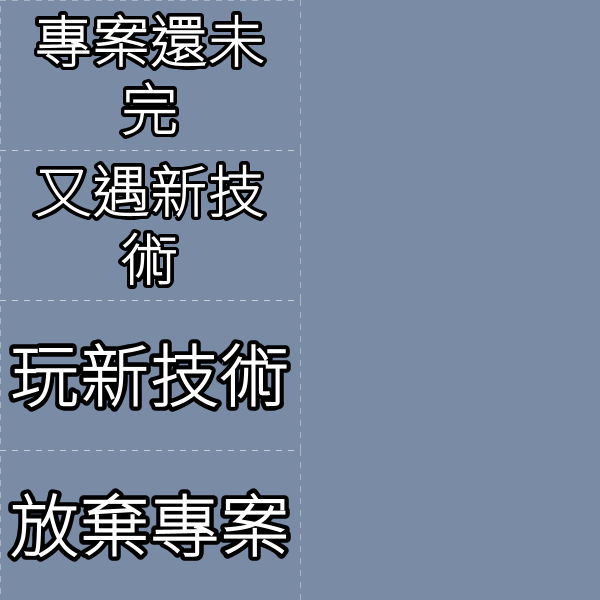
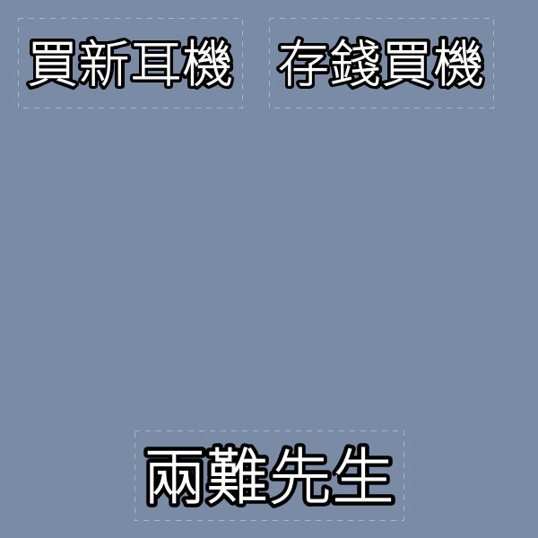
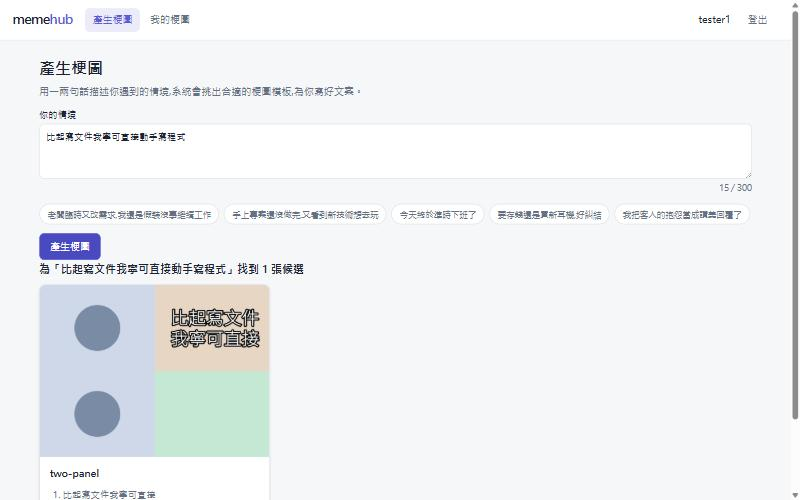
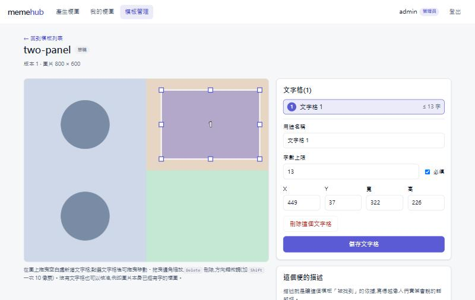
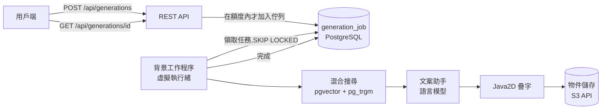
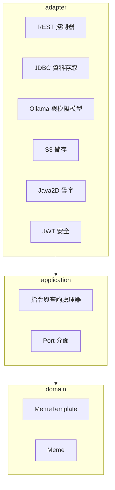

# memehub

用自己的話描述一個情境,就得到符合情境的迷因(梗圖)候選。

> *「老闆又臨時改需求,我還要假裝沒事」* → 系統找出適合的梗圖模板,為每個模板寫好文案、
> 把字畫上去,最後給你三張候選圖讓你挑。

[English](README.md) · **繁體中文**

| | |
|---|---|
|  |  |

*這是整條流程的真實輸出(`bge-m3` 負責檢索、`qwen2.5:7b` 負責寫文案、文字由程式畫上去)。
因為沒有附上有授權的模板圖片,所以這裡是畫在純色的佔位背景上。*

**目前狀態:** 後端與網頁介面(繁體中文)都已完成並有測試涵蓋。

| 產生梗圖 | 在模板上標出文字格 |
|---|---|
|  |  |

> 設計取捨的完整說明(英文)在 **[docs/DECISIONS.md](docs/DECISIONS.md)**。

---

## 它做什麼

1. 管理員上傳模板圖片、標出文字要放的位置(**文字格**),並描述這個梗的**意思**與使用時機。
   這段描述就是讓模板「找得到」的關鍵。
2. 使用者描述一個情境。系統用語意(embedding)與關鍵字搜尋模板,請語言模型為最適合的前三個模板
   的每個文字格寫文案,把文字畫到圖上,回傳三張候選。
3. 使用者留下喜歡的那一張。

生成是**非同步**的:送出請求後立刻拿到一個任務編號,再用輪詢取得結果。

## 運作方式



程式碼採用 Clean Architecture,只有真正有業務規則的兩個部分使用 DDD:



依賴方向只能由外向內,並且有 ArchUnit 測試,一旦違反就無法通過建置。

## 技術

| | |
|---|---|
| 語言與框架 | Java 21、Spring Boot 3.5 |
| 網頁前端 | React 19、TypeScript、Vite、React Router(不使用 UI 套件) |
| 資料庫 | PostgreSQL 16,搭配 `pgvector`(語意搜尋)與 `pg_trgm`(關鍵字搜尋),以 Flyway 管理遷移 |
| 物件儲存 | 任何相容 S3 的服務,透過 AWS SDK v2(Docker Compose 使用 RustFS) |
| 模型 | [Ollama](https://ollama.com):`bge-m3` 做 embedding、`qwen2.5:7b` 寫文案;預設使用可重現的模擬模型 |
| 安全 | Spring Security Resource Server、HS256 JWT、BCrypt |
| 併發 | PostgreSQL 任務佇列(`FOR UPDATE SKIP LOCKED`)、以虛擬執行緒執行的背景工作 |
| 測試 | JUnit 5、Mockito、Testcontainers、ArchUnit、Awaitility |

## 快速開始

需要 **JDK 21**、**Maven**、**Docker**。Ollama 為選用。

```powershell
# 1. 產生 .env,內含隨機產生的密碼(不會覆蓋已存在的 .env)
powershell -ExecutionPolicy Bypass -File scripts/init-env.ps1

# 2. 啟動 PostgreSQL(含 pgvector)與物件儲存
docker compose up -d

# 3. 執行應用程式
mvn spring-boot:run
```

第一位管理員會在啟動時,依 `.env` 裡的 `MEMEHUB_ADMIN_USERNAME` 與 `MEMEHUB_ADMIN_PASSWORD` 建立。
只要缺少任何必要的密碼,應用程式就會拒絕啟動。在 Linux 或 macOS 上,請參考
[`.env.example`](.env.example) 自行建立 `.env`。

預設的模型是**模擬的**:快速、結果固定,但內容是假的。要改用真正的模型:

```powershell
ollama pull bge-m3
ollama pull qwen2.5:7b
$env:MEMEHUB_EMBEDDING_PROVIDER = "ollama"
$env:MEMEHUB_LLM_PROVIDER = "ollama"
mvn spring-boot:run
```

### 網頁介面

需要 **Node.js 20 或更新版本**。後端啟動後:

```bash
cd web
npm install
npm run dev        # http://localhost:5173
```

用 `.env` 裡的管理員登入,或在登入頁建立一般帳號。以管理員身分進入「模板管理」,可以上傳模板、
在圖上拖曳出文字格、描述這個梗並核准。開發伺服器會把 `/api` 轉送到 `localhost:8080`,所以瀏覽器只看到
一個來源,不需要設定 CORS。`npm run build` 會在 `web/dist` 產生靜態檔案,可以用任何靜態網站服務提供,
只要把 `/api` 轉送到後端即可(應用程式本身不提供這些檔案)。

### 用 `curl` 試試看

```bash
BASE=http://localhost:8080

# 以管理員登入(密碼是 .env 裡的 MEMEHUB_ADMIN_PASSWORD)
ADMIN=$(curl -s -H 'Content-Type: application/json' \
  -d '{"username":"admin","password":"<MEMEHUB_ADMIN_PASSWORD>"}' $BASE/api/auth/login | jq -r .token)

# 上傳模板圖片、填寫描述、新增一個文字格、核准
ID=$(curl -s -H "Authorization: Bearer $ADMIN" -F name="Drake" -F file=@drake.png \
  $BASE/api/admin/templates | jq -r .id)
curl -X PUT -H "Authorization: Bearer $ADMIN" -H 'Content-Type: application/json' \
  --data-binary @- $BASE/api/admin/templates/$ID/profile <<'EOF'
{"meaning":"拒絕一件事,偏好另一件事","usageExamples":["不想寫文件,只想直接寫程式"]}
EOF
curl -X POST -H "Authorization: Bearer $ADMIN" -H 'Content-Type: application/json' \
  --data-binary @- $BASE/api/admin/templates/$ID/slots <<'EOF'
{"slotNo":1,"role":"被拒絕的事物","maxChars":14,"x":300,"y":0,"width":300,"height":300}
EOF
curl -X POST -H "Authorization: Bearer $ADMIN" $BASE/api/admin/templates/$ID/approve
curl -X POST -H "Authorization: Bearer $ADMIN" $BASE/api/admin/index/sync   # 或等約 15 秒

# 建立一般使用者帳號,然後要求產生梗圖
curl -X POST -H 'Content-Type: application/json' \
  -d '{"username":"alice","password":"a-long-password"}' $BASE/api/auth/register
USER=$(curl -s -H 'Content-Type: application/json' \
  -d '{"username":"alice","password":"a-long-password"}' $BASE/api/auth/login | jq -r .token)
JOB=$(curl -s -H "Authorization: Bearer $USER" -H 'Content-Type: application/json' \
  --data-binary @- $BASE/api/generations <<'EOF' | jq -r .jobId
{"situation":"比起寫文件我寧可直接動手寫程式"}
EOF
)

curl -s -H "Authorization: Bearer $USER" $BASE/api/generations/$JOB | jq   # 輪詢直到 COMPLETED
```

結果會列出每個候選的圖片網址(有時效)與寫出的文案。`POST /api/memes/{id}/keep` 可以留下其中一張。

> **在 Windows 上要注意:** 範例用到 `curl` 與 `jq`,並在 Git Bash 這類 bash 環境執行。如果把中文直接寫在
> `curl` 的 `-d '...'` 參數裡,Windows 會用舊的系統編碼把參數交給 `curl.exe`,送出的 JSON 不是合法的 UTF-8,
> 伺服器會回 `400`。所以含中文的內容請像上面這樣用 `--data-binary @-` 從標準輸入傳入(或存成 UTF-8 檔案後用
> `--data-binary @檔名`)。

## API

| 方法與路徑 | 誰能用 | 用途 |
|---|---|---|
| `POST /api/auth/register` | 任何人 | 建立使用者帳號 |
| `POST /api/auth/login` | 任何人 | 取得 Bearer token(2 小時) |
| `GET /api/templates/search?q=&limit=` | 已登入 | 以語意與關鍵字搜尋模板 |
| `POST /api/generations` | 已登入 | 為一個情境要求產生梗圖(`202`,回傳 `jobId`) |
| `GET /api/generations/{id}` | 擁有者 | 任務狀態與候選梗圖 |
| `POST /api/memes/{id}/keep` | 擁有者 | 留下一張候選 |
| `GET /api/memes[?status=&limit=]` | 已登入 | 自己的梗圖(預設是留下的那些) |
| `GET /api/memes/{id}/image` | 擁有者 | 下載完成的圖片 |
| `POST /api/admin/templates` | 管理員 | 上傳模板圖片(multipart:`name`、`file`) |
| `GET /api/admin/templates[?status=]`、`GET /api/admin/templates/{id}` | 管理員 | 列出 / 讀取模板 |
| `PUT /api/admin/templates/{id}/profile` | 管理員 | 含意、使用範例、情緒、別名 |
| `POST` · `PUT` · `DELETE /api/admin/templates/{id}/slots[/{n}]` | 管理員 | 新增、修改、刪除文字格 |
| `POST /api/admin/templates/{id}/approve` · `/retire` | 管理員 | 發佈 / 下架模板 |
| `POST /api/admin/index/sync` | 管理員 | 立刻同步搜尋索引 |
| `GET /actuator/health` | 任何人 | 健康檢查 |

錯誤以 problem-details 的 JSON 格式回傳。已知需要等待多久時,`429` 回應會帶 `Retry-After`。

## 保護系統的限制

| 項目 | 預設值 |
|---|---|
| 同一個來源位址對同一個帳號登入失敗 | 15 分鐘內 5 次,之後鎖定 |
| 同一個來源位址登入失敗(所有帳號合計) | 15 分鐘內 30 次 |
| 同一個來源位址註冊 | 每小時 5 次 |
| 每位使用者同時進行中的生成請求 | 2 個 |
| 每位使用者每天的生成請求 | 50 個 |
| 每個應用程式實例同時執行的生成任務 | 4 個 |

都可以透過 `memehub.security.throttling.*` 與 `memehub.generation.*` 調整;
也可以用 `memehub.security.registration-enabled=false` 關閉註冊。

## 測試

```bash
mvn test
```

後端預設會執行 148 個測試(另有下面兩個需要手動啟用的評測)。整合測試會用 Testcontainers 啟動真正的
PostgreSQL(含 pgvector)與相容 S3 的儲存服務,沒有開啟 Docker 時會自動跳過。

網頁前端有 63 個測試(涵蓋文字格編輯器背後的運算、API 客戶端、登入狀態):

```bash
cd web
npm test
npm run typecheck
```

兩個評測使用**真正**的模型,不包含在一般建置裡:

```bash
mvn test -Dtest=SearchQualityEvalTest -Dmemehub.eval=true       # 檢索品質 → target/search-eval.txt
mvn test -Dtest=GenerationQualityEvalTest -Dmemehub.eval=true   # 完整流程 → target/eval-memes/
```

## 實測結果

使用真實的 `bge-m3`、12 個手寫模板、20 個情境查詢(由作者自己撰寫,所以絕對數字偏樂觀,
適合用來比較改動前後):

| 搜尋方式 | 第 1 名正確 | 前 3 名內 |
|---|---|---|
| 語意(向量) | 75% | 90% |
| 關鍵字 | 5% | 5% |
| 混合(應用程式採用) | 75% | 90% |

- 對「情境描述」,關鍵字搜尋沒有貢獻,它是 embedding 服務失效時的備援。用**名稱**搜尋時有效(90%)。
- 產生三張候選**約需 3 到 8 秒**(一張 RTX 4060、`qwen2.5:7b`)。
- 測試證明:12 個執行緒同時搶 60 個排隊中的任務,每個任務恰好只被領取一次。

更詳細的內容,包括一個**沒有採用**的實驗與原因,請看
[docs/DECISIONS.md](docs/DECISIONS.md#5-hybrid-search-and-what-the-numbers-say-about-it)(英文)。

## 已知限制

- **網頁介面是用人工在瀏覽器裡檢查的,沒有自動化的瀏覽器(端對端)測試。** 模板編輯頁只在桌面寬度試過;
  其他頁面另外檢查過手機寬度與深色模式。
- **文案品質就是 7B 模型的程度:** 有時不太通順,偶爾會混入簡體字;太長的文案會被硬切在字數上限,
  可能切在詞的中間。
- **搜尋永遠回傳最接近的模板**,即使描述和梗圖毫無關係也一樣;相關與不相關的距離範圍重疊,
  所以沒有設定門檻。
- **登入與註冊的限流是各實例各自計算**(存在記憶體),來源位址取自 `getRemoteAddr()`。
  放在反向代理後面之前,必須先設定轉送標頭。見
  [設計決策 9](docs/DECISIONS.md#9-stateless-jwt-and-throttling-that-is-honest-about-its-limits)。
- 沒有忘記密碼、信箱驗證與登出功能。
- 疊字需要支援中文的字型。Linux 容器需要自行安裝(例如 Noto Sans CJK)。
- 沒有附上模板圖片(授權考量),評測使用純色的佔位圖片。

## 專案結構

```
src/main/java/com/memehub
├── domain          MemeTemplate、Meme 聚合與使用者(不含框架程式碼)
├── application     指令與查詢處理器,以及它們依賴的 Port
├── adapter
│   ├── in/web          REST 控制器、錯誤對應
│   ├── out/persistence JDBC 資料存取與讀取模型
│   ├── out/ai          Ollama 與模擬模型、文案助手
│   ├── out/storage     S3    out/render  Java2D 疊字    out/image  圖片檢查
│   ├── scheduling      索引同步與生成任務的背景工作
│   └── security        JWT、BCrypt、限流器
└── config          元件組裝與必要密碼的啟動檢查
src/main/resources/db/migration    Flyway 遷移
web/                               React + TypeScript 網頁前端(Vite)
docs/DECISIONS.md                  為什麼這樣設計(英文)
```

## 設定

密碼來自 `.env` 或真正的環境變數,**沒有任何預設值**。

| 變數 | 意義 |
|---|---|
| `DB_USERNAME`、`DB_PASSWORD` | PostgreSQL |
| `S3_ACCESS_KEY`、`S3_SECRET_KEY` | 物件儲存 |
| `MEMEHUB_JWT_SECRET` | 簽發 token 的密鑰(至少 32 個字元)。知道它的人可以偽造管理員 token |
| `MEMEHUB_ADMIN_USERNAME`、`MEMEHUB_ADMIN_PASSWORD` | 第一位管理員 |
| `MEMEHUB_LLM_PROVIDER`、`MEMEHUB_EMBEDDING_PROVIDER` | `mock`(預設)或 `ollama` |

其他設定都在 [`application.yml`](src/main/resources/application.yml)。
