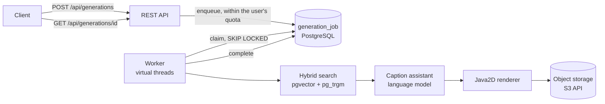
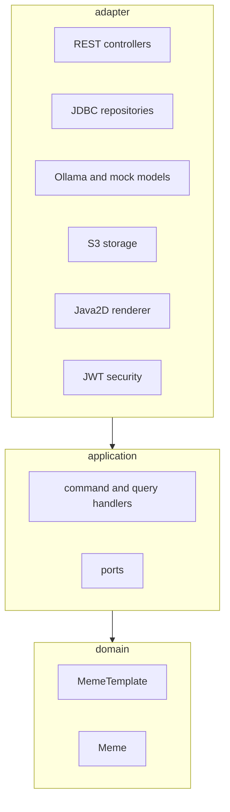

# wtm

A personal meme library: collect memes from the web, let a vision model tag them, and find the
one you want later by describing the situation in your own words.

> *"When I do not understand what someone just said"* → the confused-face meme comes back,
> even though you never knew its name.

## Why

While chatting, you sometimes want to answer with a meme. You remember the **situation** it fits,
not its name, so you cannot find it. And a phone camera roll full of saved memes is hard to search
and takes up space. wtm keeps the pictures in one place, tagged with what they mean and when to
use them, so the situation you remember is enough to find them.

**English** · [繁體中文](README.zh-TW.md)

| | |
|---|---|
|  |  |

*Real output of the pipeline (retrieval by `bge-m3`, captions by `qwen2.5:7b`, text drawn by the
app). Rendered on a plain placeholder background because no licensed template images are shipped.*

**Status:** the backend and a web UI (in Traditional Chinese) are complete and tested.

| Generating memes | Marking caption slots on a template |
|---|---|
|  |  |

---

## What it does

The main feature is the **library**: pictures come in (a folder, a pasted address, or a source such
as Imgflip or Wikimedia Commons), are de-duplicated, tagged automatically, and searched by meaning
and keywords. The rest of this section describes the secondary feature, **adding text to a library
meme**.

1. An administrator uploads a template image, marks where captions go (the *slots*), and describes
   what the meme **means** and when people use it. This description is what makes a template findable.
2. A user describes a situation. The system searches templates by meaning (embeddings) and by
   keywords, asks a language model to write a caption for every slot of the best three, draws the
   text onto the images, and returns three candidates.
3. The user keeps the one they like.

Generation is asynchronous: the request returns immediately with a job id, and the result is
fetched by polling.

## How it works



The code follows Clean Architecture, and only the two parts that have real rules use DDD:



Dependencies only point inward, and an ArchUnit test fails the build if they do not.
The reasoning behind this and the other major choices, including what was measured and what the
trade-offs are, is in **[docs/DECISIONS.md](docs/DECISIONS.md)**.

## Tech stack

| | |
|---|---|
| Language / framework | Java 21, Spring Boot 3.5 |
| Web client | React 19, TypeScript, Vite, React Router (no UI library) |
| Database | PostgreSQL 16 with `pgvector` (semantic search) and `pg_trgm` (keyword search), Flyway migrations |
| Object storage | Any S3-compatible store through the AWS SDK v2 (RustFS in Docker Compose) |
| Models | [Ollama](https://ollama.com): `bge-m3` for embeddings, `qwen2.5:7b` for captions; a deterministic mock is the default |
| Security | Spring Security resource server, HS256 JWT, BCrypt |
| Concurrency | PostgreSQL job queue (`FOR UPDATE SKIP LOCKED`), workers on virtual threads |
| Tests | JUnit 5, Mockito, Testcontainers, ArchUnit, Awaitility |

## Quick start

You need **JDK 21**, **Maven** and **Docker**. Ollama is optional.

```powershell
# 1. Create .env with freshly generated random secrets (never overwrites an existing one)
powershell -ExecutionPolicy Bypass -File scripts/init-env.ps1

# 2. Start PostgreSQL (with pgvector) and the object storage
docker compose up -d

# 3. Run the application
mvn spring-boot:run
```

The first administrator is created at startup from `WTM_ADMIN_USERNAME` and
`WTM_ADMIN_PASSWORD` in `.env`. The application refuses to start if a required secret is
missing. On Linux or macOS, create `.env` by hand from [`.env.example`](.env.example).

By default the models are **mocks**: fast, deterministic and fake. To use the real ones:

```powershell
ollama pull bge-m3
ollama pull qwen2.5:7b
$env:WTM_EMBEDDING_PROVIDER = "ollama"
$env:WTM_LLM_PROVIDER = "ollama"
mvn spring-boot:run
```

### The web UI

You need **Node.js 20 or newer**. With the backend running:

```bash
cd web
npm install
npm run dev        # http://localhost:5173
```

Sign in with the administrator from `.env`, or create an ordinary account from the sign-in page.
As administrator, **模板管理** is where you upload a template, drag out its caption slots on the image,
describe the meme and approve it. The dev server forwards `/api` to `localhost:8080`, so the browser sees
a single origin and no CORS setup is needed. `npm run build` produces static files in `web/dist` that
any static host can serve, as long as `/api` is forwarded to the backend (the application does not serve
them itself).

### Try it with `curl`

```bash
BASE=http://localhost:8080

# Sign in as the administrator (password is WTM_ADMIN_PASSWORD in .env)
ADMIN=$(curl -s -H 'Content-Type: application/json'   -d '{"username":"admin","password":"<WTM_ADMIN_PASSWORD>"}' $BASE/api/auth/login | jq -r .token)

# Add a meme you found on the web: a picture of Nick Young looking confused, with "???" around him
# ([docs/images/confused-nick-young.jpeg](docs/images/confused-nick-young.jpeg)). It is stored once
# (a copy of the same picture is recognised and skipped) and queued for tagging.
curl -s -H "Authorization: Bearer $ADMIN"   -F "files=@docs/images/confused-nick-young.jpeg" $BASE/api/admin/collection/files | jq

# A moment later the vision model has written its tags: what the picture means, when to use it,
# the feeling, and the text in it ("???")
curl -s -H "Authorization: Bearer $ADMIN" $BASE/api/admin/collection/status | jq
curl -X POST -H "Authorization: Bearer $ADMIN" $BASE/api/admin/index/sync   # or wait ~15 s

# Find it again by describing the situation
curl -s -H "Authorization: Bearer $ADMIN" -G $BASE/api/templates/search   --data-urlencode "q=when I do not understand what someone just said" | jq '.[0]'
```

The first hit is the picture above, with its meaning, tags, emotions and where it came from.
You can also drop pictures into the `inbox` folder of the data folder, paste an address
(`POST /api/admin/collection/url`), or let a source such as Imgflip or Wikimedia Commons
fill the library (`POST /api/admin/collection/runs`).

> The examples use `curl` and `jq` in a bash shell. On Windows, putting non-ASCII text (such as Chinese)
> directly inside a `curl -d '...'` argument hands it to `curl.exe` in the legacy system encoding, so the
> JSON is not valid UTF-8 and the server answers `400`. Pass such JSON on standard input instead
> (`--data-binary @-` with a here-document) or from a UTF-8 file. [README.zh-TW.md](README.zh-TW.md)
> shows this form.

## API

| Method and path | Who | Purpose |
|---|---|---|
| `POST /api/auth/register` | anyone | Create a user account |
| `POST /api/auth/login` | anyone | Get a bearer token (2 h) |
| `GET /api/templates/search?q=&limit=` | signed in | Search templates by meaning and keywords |
| `POST /api/generations` | signed in | Request memes for a situation (`202`, returns `jobId`) |
| `GET /api/generations/{id}` | owner | Job status and candidate memes |
| `POST /api/memes/{id}/keep` | owner | Keep a candidate |
| `GET /api/memes[?status=&limit=]` | signed in | Your own memes (the kept ones by default) |
| `GET /api/memes/{id}/image` | owner | Download the finished image |
| `POST /api/admin/templates` | admin | Upload a template image (multipart `name`, `file`) |
| `GET /api/admin/templates[?status=]`, `GET /api/admin/templates/{id}` | admin | List / read templates |
| `PUT /api/admin/templates/{id}/profile` | admin | Meaning, usage examples, emotions, aliases |
| `POST` · `PUT` · `DELETE /api/admin/templates/{id}/slots[/{n}]` | admin | Define, change, remove a caption slot |
| `POST /api/admin/templates/{id}/approve` · `/retire` | admin | Publish / withdraw a template |
| `POST /api/admin/index/sync` | admin | Bring the search index up to date now |
| `GET /actuator/health` | anyone | Health check |

Errors are returned as problem-details JSON. `429` responses carry `Retry-After` when the wait is known.

## Limits that protect the system

| What | Default |
|---|---|
| Failed sign-ins per account from one address | 5 per 15 min, then locked |
| Failed sign-ins from one address | 30 per 15 min |
| Registrations from one address | 5 per hour |
| Meme requests in progress per user | 2 |
| Meme requests per user per day | 50 |
| Concurrent generation jobs per instance | 4 |

All are configurable under `wtm.security.throttling.*` and `wtm.generation.*`;
registration can be switched off with `wtm.security.registration-enabled=false`.

## Tests

```bash
mvn test
```

The backend has 148 tests that run by default (plus the two on-demand evaluations below). The integration
tests start real PostgreSQL (pgvector) and an S3-compatible store with Testcontainers and are skipped
automatically when Docker is not running.

The web client has 63 tests (the logic behind the slot editor, the API client, sign-in state):

```bash
cd web
npm test
npm run typecheck
```

Two evaluations use the **real** models and are excluded from the normal build:

```bash
mvn test -Dtest=SearchQualityEvalTest -Dwtm.eval=true       # retrieval quality → target/search-eval.txt
mvn test -Dtest=GenerationQualityEvalTest -Dwtm.eval=true   # full pipeline → target/eval-memes/
```

## What was measured

Real `bge-m3`, 12 hand-written templates, 20 situation queries (written by the author, so treat the
absolute numbers as optimistic and use them to compare changes):

| Search | first result correct | in top 3 |
|---|---|---|
| semantic (vector) | 75% | 90% |
| keyword | 5% | 5% |
| hybrid (what the app uses) | 75% | 90% |

- The keyword ranking adds nothing for situation queries; it is a fallback for when the embedding
  service is down. By *name* it works (90%).
- A job takes **about 3–8 seconds** for three candidates (one RTX 4060, `qwen2.5:7b`).
- 12 threads competing for 60 queued jobs claim each exactly once (a test).

More detail, including an experiment that was **not** adopted and why, is in
[docs/DECISIONS.md](docs/DECISIONS.md#5-hybrid-search-and-what-the-numbers-say-about-it).

## Known limitations

- **The web UI was checked by hand in a browser, with no automated browser (end-to-end) tests.** The
  template editor in particular has only been tried at desktop width; the other pages were also checked on
  a phone-sized screen and in dark mode.
- **Caption quality is what a 7B model gives:** sometimes awkward, occasionally Simplified Chinese
  characters slip in, and an over-long caption is cut at the slot's limit, which can land mid-word.
- **Search always returns the nearest templates**, even for an unrelated description; relevant and
  irrelevant distances overlap, so no cut-off is applied.
- **Sign-in and registration throttling is per instance** (in memory), and the client address is
  `getRemoteAddr()`. Behind a reverse proxy, forwarded headers must be configured first. See
  [decision 9](docs/DECISIONS.md#9-stateless-jwt-and-throttling-that-is-honest-about-its-limits).
- No password reset, e-mail verification or logout.
- Rendering needs a CJK font. A Linux container needs one installed (for example Noto Sans CJK).
- No template images are included (licensing). The evaluation uses plain placeholder images.

## Project layout

```
src/main/java/com/wtm
├── domain          MemeTemplate and Meme aggregates, users (no framework code)
├── application     handlers (commands and queries) and the ports they depend on
├── adapter
│   ├── in/web          REST controllers, error mapping
│   ├── out/persistence JDBC repositories and read models
│   ├── out/ai          Ollama and mock model adapters, caption assistant
│   ├── out/storage     S3 adapter    out/render  Java2D renderer    out/image  image checks
│   ├── scheduling      index sync and generation workers
│   └── security        JWT, BCrypt, rate limiter
└── config          wiring and the startup check for required secrets
src/main/resources/db/migration    Flyway migrations
web/                               React + TypeScript web client (Vite)
docs/DECISIONS.md                  why it is built this way
```

## Configuration

Secrets come from `.env` or real environment variables. None has a default.

| Variable | Meaning |
|---|---|
| `DB_USERNAME`, `DB_PASSWORD` | PostgreSQL |
| `S3_ACCESS_KEY`, `S3_SECRET_KEY` | Object storage |
| `WTM_JWT_SECRET` | Signs tokens (at least 32 characters). Anyone who knows it can forge admin tokens |
| `WTM_ADMIN_USERNAME`, `WTM_ADMIN_PASSWORD` | The first administrator |
| `WTM_LLM_PROVIDER`, `WTM_EMBEDDING_PROVIDER` | `mock` (default) or `ollama` |

Everything else is in [`application.yml`](src/main/resources/application.yml).
