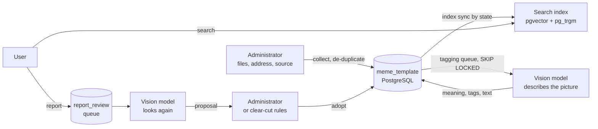
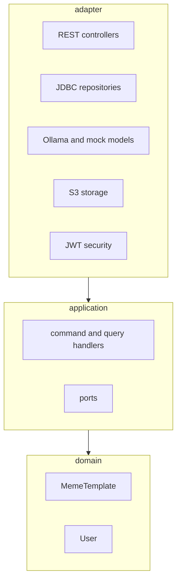

# wtm

A personal meme library: collect memes from the web, let a vision model tag them, and find the
one you want later by describing the situation in your own words.

> *"When I do not understand what someone just said"* → the confused-face meme comes back,
> even though you never knew its name.

## Why

While chatting, you sometimes want to answer with a meme. You remember the **situation** it fits,
not its name, so you cannot find it. And a phone camera roll full of saved memes is hard to search
and takes up space. wtm keeps the pictures in one place, tagged with what they mean and when to
use them, so the situation you remember is enough to find them.

**English** · [繁體中文](README.zh-TW.md)

**Status:** the backend and a web UI (in Traditional Chinese) are complete and tested.


---

## What it does

The **library**: pictures come in (a folder, a pasted address, or a source such as Imgflip, Wikimedia Commons or a
PTT board), are de-duplicated, described by a vision model, and found again by meaning and keywords. On top of it,
users find memes, keep favorites, caption a favorite in their own browser, and report descriptions that do not fit.

## How it works



The code follows Clean Architecture, and only the part that has real rules uses DDD:



Dependencies only point inward, and an ArchUnit test fails the build if they do not.
The reasoning behind this and the other major choices, including what was measured and what the
trade-offs are, is in **[docs/DECISIONS.md](docs/DECISIONS.md)**.

## Tech stack

| | |
|---|---|
| Language / framework | Java 21, Spring Boot 3.5 |
| Web client | React 19, TypeScript, Vite, React Router (no UI library) |
| Database | PostgreSQL 16 with `pgvector` (semantic search) and `pg_trgm` (keyword search), Flyway migrations |
| Object storage | Any S3-compatible store through the AWS SDK v2 (RustFS in Docker Compose) |
| Models | [Ollama](https://ollama.com): `bge-m3` for embeddings, `qwen2.5vl:7b` for looking at pictures; a deterministic mock is the default |
| Security | Spring Security resource server, HS256 JWT, BCrypt |
| Concurrency | PostgreSQL queues for tagging and report review (`FOR UPDATE SKIP LOCKED`), workers on virtual threads |
| Tests | JUnit 5, Mockito, Testcontainers, ArchUnit, Awaitility |

## Quick start

You need **JDK 21**, **Maven** and **Docker**. Ollama is optional.

```powershell
# 1. Create .env with freshly generated random secrets (never overwrites an existing one)
powershell -ExecutionPolicy Bypass -File scripts/init-env.ps1

# 2. Start PostgreSQL (with pgvector) and the object storage
docker compose up -d

# 3. Run the application
mvn spring-boot:run
```

The first administrator is created at startup from `WTM_ADMIN_USERNAME` and
`WTM_ADMIN_PASSWORD` in `.env`. The application refuses to start if a required secret is
missing. On Linux or macOS, create `.env` by hand from [`.env.example`](.env.example).

By default the models are **mocks**: fast, deterministic and fake. To use the real ones:

```powershell
ollama pull bge-m3
ollama pull qwen2.5vl:7b
$env:WTM_EMBEDDING_PROVIDER = "ollama"
$env:WTM_VISION_PROVIDER = "ollama"
mvn spring-boot:run
```

### The web UI

You need **Node.js 20 or newer**. With the backend running:

```bash
cd web
npm install
npm run dev        # http://localhost:5173
```

Sign in with the administrator from `.env`, or create an ordinary account from the sign-in page.
The web client has three pages for everyone:

- **找梗圖** (find memes): a search bar, the most common recent searches as shortcuts, and below them random memes.
  Every meme has a download button, a favorite button and a report button (for a description or tags that do not fit).
- **梗圖收藏** (favorites): your own shortlist, so a meme you will need again is one click away.
- **梗圖模板** (meme maker): pick a favorite, draw text boxes on it, type the text and download the result. The
  picture is drawn in the browser and never sent to the server, so what you make is for your own use.

Administrators also get **圖庫收集** (add pictures: choose files or a folder, paste an address, or start a collection
run from a source; shows tagging progress), **意見回報** (reported memes: the complaints next to the vision model's new
proposal, to adopt or dismiss) and **圖庫管理** (describe, edit and approve library entries and templates).
The dev server forwards `/api` to `localhost:8080`, so the browser sees
a single origin and no CORS setup is needed. `npm run build` produces static files in `web/dist` that
any static host can serve, as long as `/api` is forwarded to the backend (the application does not serve
them itself).

### Try it with `curl`

```bash
BASE=http://localhost:8080

# Sign in as the administrator (password is WTM_ADMIN_PASSWORD in .env)
ADMIN=$(curl -s -H 'Content-Type: application/json'   -d '{"username":"admin","password":"<WTM_ADMIN_PASSWORD>"}' $BASE/api/auth/login | jq -r .token)

# Add a meme you found on the web: a picture of Nick Young looking confused, with "???" around him
# ([docs/images/confused-nick-young.jpeg](docs/images/confused-nick-young.jpeg)). It is stored once
# (a copy of the same picture is recognised and skipped) and queued for tagging.
curl -s -H "Authorization: Bearer $ADMIN"   -F "files=@docs/images/confused-nick-young.jpeg" $BASE/api/admin/collection/files | jq

# A moment later the vision model has written its tags: what the picture means, when to use it,
# the feeling, and the text in it ("???")
curl -s -H "Authorization: Bearer $ADMIN" $BASE/api/admin/collection/status | jq
curl -X POST -H "Authorization: Bearer $ADMIN" $BASE/api/admin/index/sync   # or wait ~15 s

# Find it again by describing the situation
curl -s -H "Authorization: Bearer $ADMIN" -G $BASE/api/templates/search   --data-urlencode "q=when I do not understand what someone just said" | jq '.[0]'
```

The first hit is the picture above, with its meaning, tags, emotions and where it came from.
You can also drop pictures into the `inbox` folder of the data folder, paste an address
(`POST /api/admin/collection/url`), or let a source such as Imgflip or Wikimedia Commons
fill the library (`POST /api/admin/collection/runs`).

> The examples use `curl` and `jq` in a bash shell. On Windows, putting non-ASCII text (such as Chinese)
> directly inside a `curl -d '...'` argument hands it to `curl.exe` in the legacy system encoding, so the
> JSON is not valid UTF-8 and the server answers `400`. Pass such JSON on standard input instead
> (`--data-binary @-` with a here-document) or from a UTF-8 file. [README.zh-TW.md](README.zh-TW.md)
> shows this form.

## API

| Method and path | Who | Purpose |
|---|---|---|
| `POST /api/auth/register` | anyone | Create a user account |
| `POST /api/auth/login` | anyone | Get a bearer token (2 h) |
| `GET /api/templates/search?q=&limit=` | signed in | Search the library by meaning and keywords (short searches that find something are counted) |
| `GET /api/library/random?limit=` | signed in | Published memes in random order |
| `GET /api/library/hot-searches?limit=` | signed in | The most common searches of the last 7 days |
| `GET /api/library/{id}/image` | signed in | The original picture of a published meme (download, or drawing on a canvas) |
| `GET /api/favorites` · `PUT` · `DELETE /api/favorites/{id}` | signed in | Your own favorites |
| `POST /api/reports` | signed in | Report a meme (`templateId`, `reason`, `comment`); asks the vision model to look again |
| `POST /api/admin/templates` | admin | Upload a template image (multipart `name`, `file`) |
| `GET /api/admin/templates[?status=]`, `GET /api/admin/templates/{id}` | admin | List / read templates |
| `PUT /api/admin/templates/{id}/profile` | admin | Meaning, usage examples, emotions, aliases |
| `POST` · `PUT` · `DELETE /api/admin/templates/{id}/slots[/{n}]` | admin | Define, change, remove a text slot (kept from the earlier caption feature; the web client does not use it) |
| `POST /api/admin/templates/{id}/approve` · `/retire` | admin | Publish / withdraw a template |
| `GET /api/admin/reports` | admin | Reported memes: complaints, current description, the model's proposal |
| `POST /api/admin/reports/{id}/apply` · `/dismiss` · `/reanalyze` · `/undo`, `GET /api/admin/reports/automatic` | admin | Adopt the proposal, set the reports aside, ask the model again, take an automatic decision back, list what the rules did |
| `POST /api/admin/index/sync` | admin | Bring the search index up to date now |
| `GET /actuator/health` | anyone | Health check |

Errors are returned as problem-details JSON. `429` responses carry `Retry-After` when the wait is known.

## Limits that protect the system

| What | Default |
|---|---|
| Failed sign-ins per account from one address | 5 per 15 min, then locked |
| Failed sign-ins from one address | 30 per 15 min |
| Registrations from one address | 5 per hour |
| Different memes one person may report per day | 10 (and 30 open reports at most) |
| Reporters' combined weight before the vision model looks on its own | 2 (newcomer 1, proven reporter 2, repeat false reporter 0, administrator 2) |
| Time before the vision model looks at the same meme again | 24 hours |
| Looks by the vision model for reports, whole site, per day | 50 (an administrator's request is exempt) |
| Combined weight at which a proposal is adopted without an administrator | 3 |

All are configurable under `wtm.security.throttling.*` and `wtm.reports.*`;
registration can be switched off with `wtm.security.registration-enabled=false`.

## Tests

```bash
mvn test
```

The backend has 277 tests that run by default (plus the on-demand evaluation below). The integration
tests start real PostgreSQL (pgvector) and an S3-compatible store with Testcontainers and are skipped
automatically when Docker is not running.

The web client has 95 tests (the logic behind the box editor and text fitting, the API client, favorites, sign-in state):

```bash
cd web
npm test
npm run typecheck
```

One evaluation uses the **real** embedding model and is excluded from the normal build:

```bash
mvn test -Dtest=SearchQualityEvalTest -Dwtm.eval=true       # retrieval quality → target/search-eval.txt
```

## What was measured

Real `bge-m3`, 12 hand-written templates, 20 situation queries (written by the author, so treat the
absolute numbers as optimistic and use them to compare changes):

| Search | first result correct | in top 3 |
|---|---|---|
| semantic (vector) | 75% | 90% |
| keyword | 5% | 5% |
| hybrid (what the app uses) | 75% | 90% |

- The keyword ranking adds nothing for situation queries; it is a fallback for when the embedding
  service is down. By *name* it works (90%).
- Looking at one picture takes the vision model **about 30 seconds** on one RTX 4060 (`qwen2.5vl:7b`), so
  collecting 200 pictures takes about an hour and a half to describe.

### On the real library

`eval/library-queries.json` holds 46 searches (situations, looks, nicknames, names) and the memes that answer them;
`node scripts/eval-search.mjs` runs them against the running application and prints the hit rates and what was found
instead for every miss. First measurement, on 171 searchable memes, with `bge-m3`:

| Kind of search | n | first result | in top 3 | in top 10 |
|---|---|---|---|---|
| situation | 17 | 76% | 82% | 94% |
| look | 18 | 89% | 100% | 100% |
| nickname | 6 | 67% | 83% | 100% |
| name | 5 | 100% | 100% | 100% |
| **all** | 46 | **83%** | **91%** | **98%** |

Median search time 117 ms; the first search after a quiet period took 4.4 s while the embedding model loaded.

How far to trust it: the queries were written by the same person who built the library, and they only ask for
well-known memes that have a proper name (the 50 PTT pictures are all called 「未命名梗圖」 and cannot be asked for by
name, so none is in the set). Treat the numbers as an upper bound and as a way to compare changes. The misses are
mostly bad descriptions, not bad search: *Bad Luck Brian* was described as "a surprised face", so no query about bad
luck finds it.

More detail, including an experiment that was **not** adopted and why, is in
[docs/DECISIONS.md](docs/DECISIONS.md#5-hybrid-search-and-what-the-numbers-say-about-it).

## Known limitations

- **The web UI was checked by hand in a browser, with no automated browser (end-to-end) tests.** The
  template editor in particular has only been tried at desktop width; the other pages were also checked on
  a phone-sized screen and in dark mode.
- **PTT's 笨板 is a poor source of memes.** Most of its pictures are photos of funny real-life things, news and
  screenshots, not pictures people send to answer someone. Of the 50 that were published, 41 were withdrawn by hand
  after review, and the board is no longer worth collecting. Users can report a picture as "not a meme", which is
  always left to the administrator.
- **The vision model decides whether a picture is a meme, and it is cautious.** Of 201 collected pictures it
  withdrew 35, including six well-known Imgflip templates. Withdrawn pictures can be looked at and brought back by
  an administrator.
- **Search always returns the nearest templates**, even for an unrelated description; relevant and
  irrelevant distances overlap, so no cut-off is applied.
- **Sign-in and registration throttling is per instance** (in memory), and the client address is
  `getRemoteAddr()`. Behind a reverse proxy, forwarded headers must be configured first. See
  [decision 9](docs/DECISIONS.md#9-stateless-jwt-and-throttling-that-is-honest-about-its-limits).
- **Hot searches are shared.** A short phrase (2 to 30 characters) that found something is counted, and the most
  common ones are shown to every signed-in user, without saying who typed them. Longer sentences are never
  recorded. Rows are kept forever; only the last 7 days are read.
- **Each look by the vision model costs about a minute**, so what reports can cost is capped (see the limits above):
  trust weights, a cooldown per meme, a daily budget for the whole site. The budget is the real ceiling: however many
  accounts there are, the model is not kept busy for more than 50 looks a day. Reports above the limits are still
  recorded for the administrator. With the mock model the proposal is fixed text (a complaint containing `[keep]`
  makes it find nothing wrong, for testing).
- **Reports can change a description on their own**, but only when the evidence is clear: the model finds nothing wrong
  and few people insist (reports closed), or at least three trusted-weight reporters agree and the model proposes a
  usable new description (adopted). Anything about whether a picture belongs, a "not a meme" answer, many people
  against the model, and any look an administrator asked for are left to the administrator. Every automatic decision
  is listed for 7 days and can be taken back. It is only as good as a 7B model plus the people reporting.
- **The meme maker keeps nothing.** What you make exists only until you download it or close the tab, and an
  animated GIF becomes a still picture once text is added.
- No password reset, e-mail verification or logout.
- No template images are included (licensing). The evaluation uses hand-written descriptions only.

## Project layout

```
src/main/java/com/wtm
├── domain          MemeTemplate aggregate, users (no framework code)
├── application     handlers (commands and queries) and the ports they depend on
├── adapter
│   ├── in/web          REST controllers, error mapping
│   ├── out/persistence JDBC repositories and read models
│   ├── out/ai          Ollama and mock model adapters (embeddings, vision)
│   ├── out/source      collectors: Imgflip, Wikimedia Commons, PTT
│   ├── out/storage     S3 adapter    out/image  image checks
│   ├── scheduling      index sync, tagging and review workers
│   └── security        JWT, BCrypt, rate limiter
└── config          wiring and the startup check for required secrets
src/main/resources/db/migration    Flyway migrations
web/                               React + TypeScript web client (Vite)
docs/DECISIONS.md                  why it is built this way
```

## Configuration

Secrets come from `.env` or real environment variables. None has a default.

| Variable | Meaning |
|---|---|
| `DB_USERNAME`, `DB_PASSWORD` | PostgreSQL |
| `S3_ACCESS_KEY`, `S3_SECRET_KEY` | Object storage |
| `WTM_JWT_SECRET` | Signs tokens (at least 32 characters). Anyone who knows it can forge admin tokens |
| `WTM_ADMIN_USERNAME`, `WTM_ADMIN_PASSWORD` | The first administrator |
| `WTM_VISION_PROVIDER`, `WTM_EMBEDDING_PROVIDER` | `mock` (default) or `ollama` |

Everything else is in [`application.yml`](src/main/resources/application.yml).
