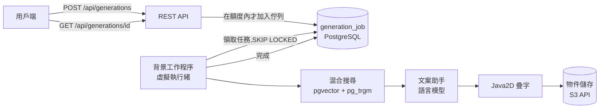
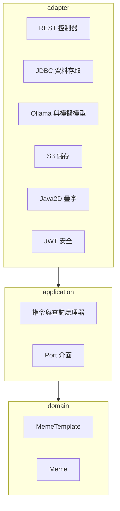

# wtm

個人的梗圖圖庫:從網路上收集梗圖,由視覺模型自動標上標籤,之後只要用自己的話描述情境,
就能找到想用的那一張。

> *「聽不懂對方剛剛在說什麼」* → 那張一臉困惑的梗圖就出現了,即使你根本不知道它叫什麼名字。

## 為什麼做這個

跟別人聊天時,有時候想用梗圖回應,但你只記得它適用的**情境**,不記得梗圖的名稱,所以找不到當下想用的那一張。
而手機裡存了一大堆梗圖,既不好找,又佔空間。wtm 把圖片集中放在一個地方,並標上它的意思與使用時機,
讓你只憑記得的情境就能找到。

[English](README.md) · **繁體中文**

| | |
|---|---|
|  |  |

*這是整條流程的真實輸出(`bge-m3` 負責檢索、`qwen2.5:7b` 負責寫文案、文字由程式畫上去)。
因為沒有附上有授權的模板圖片,所以這裡是畫在純色的佔位背景上。*

**目前狀態:** 後端與網頁介面(繁體中文)都已完成並有測試涵蓋。

| 產生梗圖 | 在模板上標出文字格 |
|---|---|
|  |  |

> 設計取捨的完整說明(英文)在 **[docs/DECISIONS.md](docs/DECISIONS.md)**。

---

## 它做什麼

主要功能是**圖庫**:圖片從資料夾、貼上的網址,或 Imgflip、Wikimedia Commons 這類來源進來,經過去重、
自動標註,再用語意與關鍵字搜尋。本節以下描述的是次要功能:**在圖庫的梗圖上加文字**。

1. 管理員上傳模板圖片、標出文字要放的位置(**文字格**),並描述這個梗的**意思**與使用時機。
   這段描述就是讓模板「找得到」的關鍵。
2. 使用者描述一個情境。系統用語意(embedding)與關鍵字搜尋模板,請語言模型為最適合的前三個模板
   的每個文字格寫文案,把文字畫到圖上,回傳三張候選。
3. 使用者留下喜歡的那一張。

生成是**非同步**的:送出請求後立刻拿到一個任務編號,再用輪詢取得結果。

## 運作方式



程式碼採用 Clean Architecture,只有真正有業務規則的兩個部分使用 DDD:



依賴方向只能由外向內,並且有 ArchUnit 測試,一旦違反就無法通過建置。

## 技術

| | |
|---|---|
| 語言與框架 | Java 21、Spring Boot 3.5 |
| 網頁前端 | React 19、TypeScript、Vite、React Router(不使用 UI 套件) |
| 資料庫 | PostgreSQL 16,搭配 `pgvector`(語意搜尋)與 `pg_trgm`(關鍵字搜尋),以 Flyway 管理遷移 |
| 物件儲存 | 任何相容 S3 的服務,透過 AWS SDK v2(Docker Compose 使用 RustFS) |
| 模型 | [Ollama](https://ollama.com):`bge-m3` 做 embedding、`qwen2.5:7b` 寫文案;預設使用可重現的模擬模型 |
| 安全 | Spring Security Resource Server、HS256 JWT、BCrypt |
| 併發 | PostgreSQL 任務佇列(`FOR UPDATE SKIP LOCKED`)、以虛擬執行緒執行的背景工作 |
| 測試 | JUnit 5、Mockito、Testcontainers、ArchUnit、Awaitility |

## 快速開始

需要 **JDK 21**、**Maven**、**Docker**。Ollama 為選用。

```powershell
# 1. 產生 .env,內含隨機產生的密碼(不會覆蓋已存在的 .env)
powershell -ExecutionPolicy Bypass -File scripts/init-env.ps1

# 2. 啟動 PostgreSQL(含 pgvector)與物件儲存
docker compose up -d

# 3. 執行應用程式
mvn spring-boot:run
```

第一位管理員會在啟動時,依 `.env` 裡的 `WTM_ADMIN_USERNAME` 與 `WTM_ADMIN_PASSWORD` 建立。
只要缺少任何必要的密碼,應用程式就會拒絕啟動。在 Linux 或 macOS 上,請參考
[`.env.example`](.env.example) 自行建立 `.env`。

預設的模型是**模擬的**:快速、結果固定,但內容是假的。要改用真正的模型:

```powershell
ollama pull bge-m3
ollama pull qwen2.5:7b
$env:WTM_EMBEDDING_PROVIDER = "ollama"
$env:WTM_LLM_PROVIDER = "ollama"
mvn spring-boot:run
```

### 網頁介面

需要 **Node.js 20 或更新版本**。後端啟動後:

```bash
cd web
npm install
npm run dev        # http://localhost:5173
```

用 `.env` 裡的管理員登入,或在登入頁建立一般帳號。網頁前端對所有人有三個頁面:

- **找梗圖**:搜尋列、下方是最近熱門搜尋,再下面是隨機的梗圖。每張梗圖都有下載、收藏與回報(描述或標籤不精確時用)三個按鈕。
- **梗圖收藏**:你自己的收藏清單,之後要用不必再搜尋。
- **梗圖模板**:從收藏挑一張,在圖上畫文字框、輸入文字,再下載。圖是在瀏覽器裡畫的,不會送到伺服器,
  所以做出來的梗圖只供自己使用。

管理員另外有「圖庫收集」(加入圖片:選檔案或資料夾、貼網址、從來源收集,並顯示標記進度)、
「意見回報」(被回報的梗圖:用戶意見與影像模型重新分析的建議並排,由你決定採用或忽略)和
「圖庫管理」(描述、編輯並核准圖庫條目與模板)。開發伺服器會把 `/api` 轉送到 `localhost:8080`,所以瀏覽器只看到
一個來源,不需要設定 CORS。`npm run build` 會在 `web/dist` 產生靜態檔案,可以用任何靜態網站服務提供,
只要把 `/api` 轉送到後端即可(應用程式本身不提供這些檔案)。

### 用 `curl` 試試看

```bash
BASE=http://localhost:8080

# 以管理員登入(密碼是 .env 裡的 WTM_ADMIN_PASSWORD)
ADMIN=$(curl -s -H 'Content-Type: application/json'   -d '{"username":"admin","password":"<WTM_ADMIN_PASSWORD>"}' $BASE/api/auth/login | jq -r .token)

# 加入一張你在網路上找到的梗圖:Nick Young 一臉困惑、周圍飄著「???」
# ([docs/images/confused-nick-young.jpeg](docs/images/confused-nick-young.jpeg))。
# 圖片只會存一份(同一張圖再加一次會被認出來並略過),並排進標籤佇列
curl -s -H "Authorization: Bearer $ADMIN"   -F "files=@docs/images/confused-nick-young.jpeg" $BASE/api/admin/collection/files | jq

# 過一會兒,視覺模型就寫好標籤了:這張圖的意思、什麼時候用、情緒,以及圖上的字(「???」)
curl -s -H "Authorization: Bearer $ADMIN" $BASE/api/admin/collection/status | jq
curl -X POST -H "Authorization: Bearer $ADMIN" $BASE/api/admin/index/sync   # 或等約 15 秒

# 用描述情境的方式把它找回來
curl -s -H "Authorization: Bearer $ADMIN" -G $BASE/api/templates/search   --data-urlencode "q@-" <<'EOF' | jq '.[0]'
聽不懂對方剛剛在說什麼
EOF
```

第一筆就是上面那張圖,附有它的意思、標籤、情緒與來源。你也可以把圖片丟進資料夾的 `inbox`、貼網址
(`POST /api/admin/collection/url`),或讓 Imgflip、Wikimedia Commons 這類來源自動填滿圖庫
(`POST /api/admin/collection/runs`)。

> **在 Windows 上要注意:** 範例用到 `curl` 與 `jq`,並在 Git Bash 這類 bash 環境執行。如果把中文直接寫在
> `curl` 的 `-d '...'` 參數裡,Windows 會用舊的系統編碼把參數交給 `curl.exe`,送出的 JSON 不是合法的 UTF-8,
> 伺服器會回 `400`。所以含中文的內容請像上面這樣用 `--data-binary @-` 從標準輸入傳入(或存成 UTF-8 檔案後用
> `--data-binary @檔名`)。

## API

| 方法與路徑 | 誰能用 | 用途 |
|---|---|---|
| `POST /api/auth/register` | 任何人 | 建立使用者帳號 |
| `POST /api/auth/login` | 任何人 | 取得 Bearer token(2 小時) |
| `GET /api/templates/search?q=&limit=` | 已登入 | 以語意與關鍵字搜尋圖庫(找得到結果的短搜尋會被計數) |
| `GET /api/library/random?limit=` | 已登入 | 隨機取得已發佈的梗圖 |
| `GET /api/library/hot-searches?limit=` | 已登入 | 最近 7 天最常被搜尋的詞 |
| `GET /api/library/{id}/image` | 已登入 | 已發佈梗圖的原圖(下載,或拿來畫在 canvas 上) |
| `GET /api/favorites` · `PUT` · `DELETE /api/favorites/{id}` | 已登入 | 自己的收藏 |
| `POST /api/reports` | 已登入 | 回報一張梗圖(`templateId`、`reason`、`comment`),並請影像模型重新看一遍 |
| `POST /api/generations` | 已登入 | 為一個情境要求產生梗圖(`202`,回傳 `jobId`) |
| `GET /api/generations/{id}` | 擁有者 | 任務狀態與候選梗圖 |
| `POST /api/memes/{id}/keep` | 擁有者 | 留下一張候選 |
| `GET /api/memes[?status=&limit=]` | 已登入 | 自己的梗圖(預設是留下的那些) |
| `GET /api/memes/{id}/image` | 擁有者 | 下載完成的圖片 |
| `POST /api/admin/templates` | 管理員 | 上傳模板圖片(multipart:`name`、`file`) |
| `GET /api/admin/templates[?status=]`、`GET /api/admin/templates/{id}` | 管理員 | 列出 / 讀取模板 |
| `PUT /api/admin/templates/{id}/profile` | 管理員 | 含意、使用範例、情緒、別名 |
| `POST` · `PUT` · `DELETE /api/admin/templates/{id}/slots[/{n}]` | 管理員 | 新增、修改、刪除文字格 |
| `POST /api/admin/templates/{id}/approve` · `/retire` | 管理員 | 發佈 / 下架模板 |
| `GET /api/admin/reports` | 管理員 | 被回報的梗圖:用戶意見、目前的描述、模型的新建議 |
| `POST /api/admin/reports/{id}/apply` · `/dismiss` · `/reanalyze` | 管理員 | 採用建議、忽略回報、請模型重新分析 |
| `POST /api/admin/index/sync` | 管理員 | 立刻同步搜尋索引 |
| `GET /actuator/health` | 任何人 | 健康檢查 |

錯誤以 problem-details 的 JSON 格式回傳。已知需要等待多久時,`429` 回應會帶 `Retry-After`。

## 保護系統的限制

| 項目 | 預設值 |
|---|---|
| 同一個來源位址對同一個帳號登入失敗 | 15 分鐘內 5 次,之後鎖定 |
| 同一個來源位址登入失敗(所有帳號合計) | 15 分鐘內 30 次 |
| 同一個來源位址註冊 | 每小時 5 次 |
| 每位使用者同時進行中的生成請求 | 2 個 |
| 每位使用者每天的生成請求 | 50 個 |
| 每個應用程式實例同時執行的生成任務 | 4 個 |
| 每位使用者每天可以回報的不同梗圖 | 10 張(同時未處理最多 30 則) |
| 影像模型自動重新分析前,回報者的權重合計 | 2(新帳號 1、可信的回報者 2、一再亂報的 0、管理員 2) |
| 同一張梗圖再次被模型重新分析前的間隔 | 24 小時 |
| 全站每天為回報而啟動模型的次數 | 50 次(管理員手動要求的不受限) |
| 不經管理員、直接採用模型提案所需的權重合計 | 3 |

都可以透過 `wtm.security.throttling.*`、`wtm.generation.*` 與 `wtm.reports.*` 調整;
也可以用 `wtm.security.registration-enabled=false` 關閉註冊。

## 測試

```bash
mvn test
```

後端預設會執行 333 個測試(另有下面兩個需要手動啟用的評測)。整合測試會用 Testcontainers 啟動真正的
PostgreSQL(含 pgvector)與相容 S3 的儲存服務,沒有開啟 Docker 時會自動跳過。

網頁前端有 95 個測試(涵蓋文字框編輯與文字縮放的運算、API 客戶端、收藏、登入狀態):

```bash
cd web
npm test
npm run typecheck
```

兩個評測使用**真正**的模型,不包含在一般建置裡:

```bash
mvn test -Dtest=SearchQualityEvalTest -Dwtm.eval=true       # 檢索品質 → target/search-eval.txt
mvn test -Dtest=GenerationQualityEvalTest -Dwtm.eval=true   # 完整流程 → target/eval-memes/
```

## 實測結果

使用真實的 `bge-m3`、12 個手寫模板、20 個情境查詢(由作者自己撰寫,所以絕對數字偏樂觀,
適合用來比較改動前後):

| 搜尋方式 | 第 1 名正確 | 前 3 名內 |
|---|---|---|
| 語意(向量) | 75% | 90% |
| 關鍵字 | 5% | 5% |
| 混合(應用程式採用) | 75% | 90% |

- 對「情境描述」,關鍵字搜尋沒有貢獻,它是 embedding 服務失效時的備援。用**名稱**搜尋時有效(90%)。
- 產生三張候選**約需 3 到 8 秒**(一張 RTX 4060、`qwen2.5:7b`)。
- 測試證明:12 個執行緒同時搶 60 個排隊中的任務,每個任務恰好只被領取一次。

更詳細的內容,包括一個**沒有採用**的實驗與原因,請看
[docs/DECISIONS.md](docs/DECISIONS.md#5-hybrid-search-and-what-the-numbers-say-about-it)(英文)。

## 已知限制

- **網頁介面是用人工在瀏覽器裡檢查的,沒有自動化的瀏覽器(端對端)測試。** 模板編輯頁只在桌面寬度試過;
  其他頁面另外檢查過手機寬度與深色模式。
- **文案品質就是 7B 模型的程度:** 有時不太通順,偶爾會混入簡體字;太長的文案會被硬切在字數上限,
  可能切在詞的中間。
- **搜尋永遠回傳最接近的模板**,即使描述和梗圖毫無關係也一樣;相關與不相關的距離範圍重疊,
  所以沒有設定門檻。
- **登入與註冊的限流是各實例各自計算**(存在記憶體),來源位址取自 `getRemoteAddr()`。
  放在反向代理後面之前,必須先設定轉送標頭。見
  [設計決策 9](docs/DECISIONS.md#9-stateless-jwt-and-throttling-that-is-honest-about-its-limits)。
- **熱門搜尋是共用的。** 找得到結果的短詞(2 到 30 個字)會被計數,最常見的幾個會顯示給所有已登入的使用者,
  不會顯示是誰輸入的;較長的句子完全不記錄。紀錄不會自動清除,只是只讀最近 7 天。
- **模型每看一次要花約一分鐘**,所以回報能造成的花費有上限(見上面的限制):回報者權重、每張圖的冷卻、全站每日預算。
  真正的天花板是預算:不管有多少帳號,模型一天最多為回報跑 50 次。超過限制的回報仍會記錄下來給管理員。
  用 mock 模型時建議是固定文字(回報內容含 `[keep]` 時,mock 會回答「沒問題」,方便測試)。
- **回報在證據明確時可以自己改動描述:** 模型認為沒問題而且堅持的人不多時,回報會自動結案;至少三份權重合計都同意、
  而且模型提出可用的新描述時,會自動採用。涉及圖該不該放在圖庫、模型說「不是梗圖」、很多人與模型意見相反,
  以及管理員手動要求的分析,一律交給管理員。每個自動決定都會列出 7 天,可以還原。
  它的準確度取決於 7B 模型,加上回報的人。
- **梗圖模板不留任何東西。** 做好的圖只存在到你下載它或關掉分頁為止;GIF 動圖加上文字後會變成靜態圖片。
- 生成相關的端點(`/api/generations`、`/api/memes`)仍然存在,但網頁前端已經不使用。
- 沒有忘記密碼、信箱驗證與登出功能。
- 疊字需要支援中文的字型。Linux 容器需要自行安裝(例如 Noto Sans CJK)。
- 沒有附上模板圖片(授權考量),評測使用純色的佔位圖片。

## 專案結構

```
src/main/java/com/wtm
├── domain          MemeTemplate、Meme 聚合與使用者(不含框架程式碼)
├── application     指令與查詢處理器,以及它們依賴的 Port
├── adapter
│   ├── in/web          REST 控制器、錯誤對應
│   ├── out/persistence JDBC 資料存取與讀取模型
│   ├── out/ai          Ollama 與模擬模型、文案助手
│   ├── out/storage     S3    out/render  Java2D 疊字    out/image  圖片檢查
│   ├── scheduling      索引同步與生成任務的背景工作
│   └── security        JWT、BCrypt、限流器
└── config          元件組裝與必要密碼的啟動檢查
src/main/resources/db/migration    Flyway 遷移
web/                               React + TypeScript 網頁前端(Vite)
docs/DECISIONS.md                  為什麼這樣設計(英文)
```

## 設定

密碼來自 `.env` 或真正的環境變數,**沒有任何預設值**。

| 變數 | 意義 |
|---|---|
| `DB_USERNAME`、`DB_PASSWORD` | PostgreSQL |
| `S3_ACCESS_KEY`、`S3_SECRET_KEY` | 物件儲存 |
| `WTM_JWT_SECRET` | 簽發 token 的密鑰(至少 32 個字元)。知道它的人可以偽造管理員 token |
| `WTM_ADMIN_USERNAME`、`WTM_ADMIN_PASSWORD` | 第一位管理員 |
| `WTM_LLM_PROVIDER`、`WTM_EMBEDDING_PROVIDER` | `mock`(預設)或 `ollama` |

其他設定都在 [`application.yml`](src/main/resources/application.yml)。
